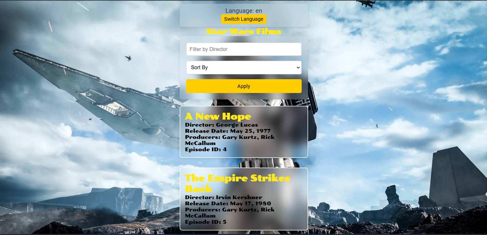

# Star-Wars

This project is a React application designed to handle movie data with features like filtering by director and sorting by title or release date.



## Prerequisites

- [Node.js](https://nodejs.org/) (version 16 or higher recommended)
- npm (comes with Node.js) or [yarn](https://yarnpkg.com/) for package management
- A code editor, such as [VS Code](https://code.visualstudio.com/)

## Setup Instructions

Follow these steps to set up and run the project locally:

### 1. Clone the Repository

Clone the repository to your local machine using Git:

```bash```
git clone https://github.com/Petresara/Star-Wars.git

### 2. Navigate to the Project Directory

cd your-repo-name

### 3. Install Dependencies

npm install
yarn install (for yarn)

### 4. Starta the Development Server

npm start
yarn start (for yarn)

The application will start, and you can view it in your browser at http://localhost:3000.

## Show Your Support 
Give a ⭐️ if you like this project!

📝 License This project is MIT licensed.